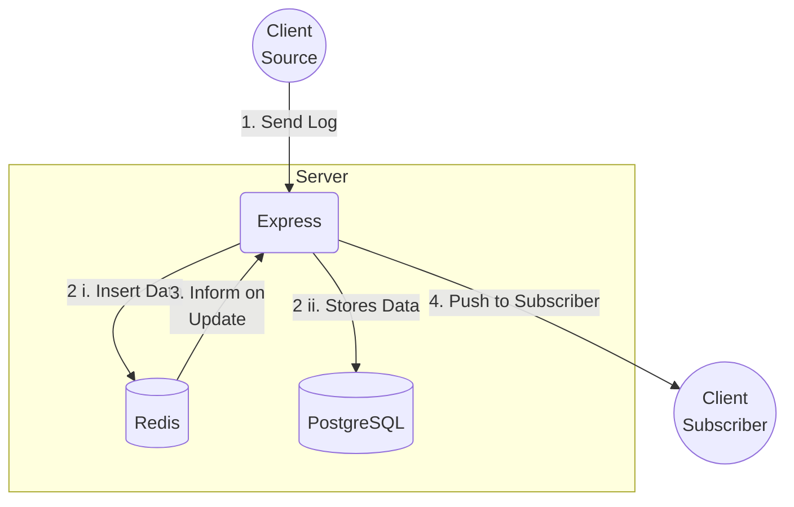
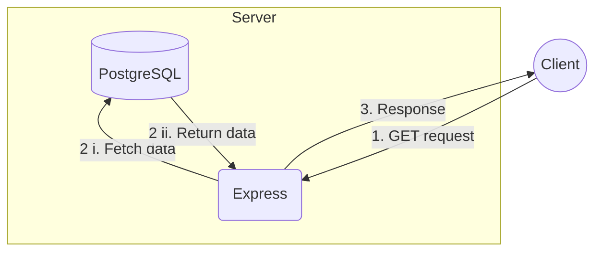

# Database Documentation

> [!NOTE]\
> This document outlines the relationships, schema, and database architecture.

---

## Logical Flow of Data

### Inserting and Subscribing to Logs

1. Client will send logs in the defined schema to the designated endpoint.
2. The `Express.js` backend will validate the `API` key.
   1. Log is inserted into a `Redis` queue.
   2. Log is persisted simultaneously in `PostgreSQL` database.
3. `Express` backend will listen to updates from `Redis`.
4. `Express` backend will send the log over a `socket` to subscribers.

### Fetching Existing Logs

1. Client will make a `GET` request to a designated endpoint on the `Express` backend.
2. `Express` backend will validate the request.
   1. A call via `Prisma` will be made to fetch existing logs persisted in `PostgreSQL`.
   2. Data will be processed and formatted.
3. Data is then sent over to the client.

